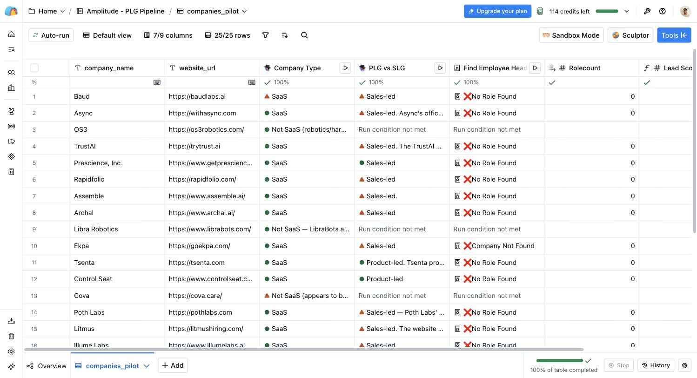
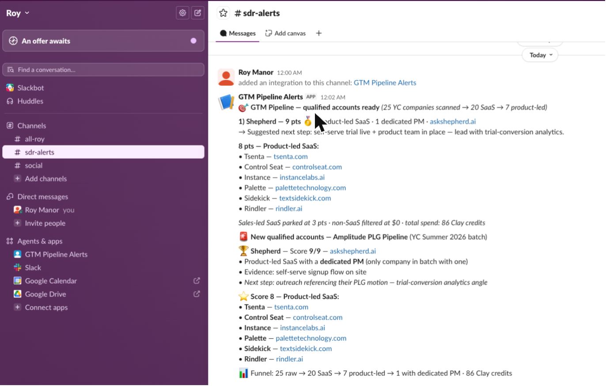

# the amplitude gtm pipeline: finding what zoominfo can't

search "software" in a traditional database and you get a mess. robotics, biotech, saas, all in one list. no database has a "product-led growth" filter, because gtm motion isn't a field in any database. it lives on the company's website, in the buttons. "book a demo" tells one story. "start free trial" tells a completely different one.

an sdr figures this out manually, with 12 open tabs per account. i wanted the machine to do it.

**the result: 25 noisy yc startups in. 20 verified saas. 7 product-led. 1 with a dedicated product hire. fully automated, 86 clay credits, zero manual research.**

## why this matters for amplitude

amplitude sells product analytics. their best buyers are product-led saas companies with real product teams, people who live off trial conversion data. that exact profile is invisible to zoominfo and sales navigator. this pipeline makes it visible, scores it, and hands it to a rep with a suggested next step. that's the whole job.

## the system

python owns the edges. clay owns the middle.

**ingestion (python)** pulls a noisy yc batch and filters the dead weight for free. **qualification (clay + claygent)** verifies saas, classifies the gtm motion, counts product hires. **activation (python)** routes only the winners to slack.

### the enriched table



### the output: a rep-ready slack alert



## how it works

### phase 1: ingestion (`phase1.py`)

- pulls a yc batch from the public json api. deliberately noisy input, saas and biotech and robotics mixed together. that's the point. if the input is clean, the ai layer proves nothing
- passes only company name + url downstream. yc has category tags and i ignore them on purpose. the qualification has to come from my system, not from the source
- free filters before any paid step: active status plus a live http check. you don't pay to analyze a dead website
- retries with exponential backoff, structured logging, dedupe across runs

### phase 2: ai qualification (clay + claygent)

three enrichment columns, each one gated so credits only burn where they should. full prompts and formulas in [prompts.md](prompts.md).

1. **saas check.** claygent visits the site and answers "saas" or labels what the company actually is. cheap model, 1 credit per row, because it's an easy question
2. **product-led vs sales-led.** the centerpiece. claygent reads the site's call-to-action buttons and classifies the gtm motion, with an 80% confidence rule. strong model, 3 credits per row, because this is the nuanced call. runs only on rows already verified as saas, so the robotics companies never cost a credit
3. **pm headcount.** counts dedicated product titles (pm, head of product, vp product, cpo). also gated on saas. charged only when data is found

### phase 3: score and route

- lead score formula, zero credits: **+5** product-led, **+3** saas, **+1** per pm
- score 8 or higher goes to slack as a formatted sdr alert with the company, the motion, the evidence and a suggested next step (`phase3_alert.py`)
- below 8, no human ever sees it. that's the feature

## pilot results (yc summer 2026 batch)

| funnel stage | count |
|---|---|
| raw companies in | 25 |
| verified saas (ai) | 20 |
| product-led | 7 |
| product-led + dedicated pm | 1 (shepherd, top score 9/9) |
| **total cost** | **86 clay credits** |

every robotics, biotech and healthcare company got filtered before a single paid enrichment ran. the scoring found a clear number one: shepherd, product-led with a dedicated pm, the exact profile amplitude pays for. and the whole pilot ran on a free clay account.

## design decisions

| decision | what i rejected | why |
|---|---|---|
| yc directory as source | g2 / capterra | a pre-categorized source makes the ai layer redundant. also g2 sits behind cloudflare and its tos says no scraping. not a fight worth having |
| public json api | selenium + proxies | found the underlying api instead of automating a browser. judgment over brute force |
| ignore yc's industry tags | filter on source metadata | cleaner data was right there and i chose not to use it, to prove the system works on raw input |
| liveness check in python | let clay handle dead sites | checks are free upstream and expensive downstream |
| cheap model for the easy call, strong model for the hard one | one model for everything | match model cost to task difficulty |
| conditional runs on every enrichment | enrich everything | roughly 40% credit savings. cost discipline at every step |
| slack webhook from python | clay's native slack integration | paywalled on the free tier. same outcome at the code layer, and now python bookends the whole pipeline |

## running it

```bash
pip install requests tenacity

# phase 1: build the list (csv path for clay free tier, --webhook for paid)
python phase1.py --csv companies.csv --batch winter-2026

# import the csv into clay, run the enrichments (prompts in prompts.md)

# phase 3: export the scored table from clay, alert slack
export SLACK_WEBHOOK_URL="https://hooks.slack.com/services/..."
python phase3_alert.py --csv clay_export.csv --min-score 8
```

## what i'd build next

- a hybrid third bucket. amplitude's real icp is companies with both a free trial and a sales team. one prompt change
- contact-level enrichment on top scorers only, the expensive lookups reserved for the few rows that earned them
- scheduled runs on every new yc batch announcement
- crm sync, so the alert lands in a pipeline and not just a channel

---

built by roy manor. economics & business, reichman university.
